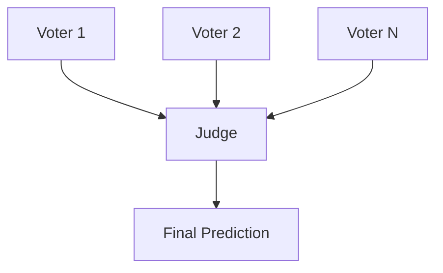

# Oscar Ballot

Generate Oscar ballot predictions using multiple LLM "expert voters" and one LLM "judge".

## Overview 📌

The project runs a two-stage workflow:

1. Expert voter models independently vote across Oscar categories.
2. A judge model receives all expert votes and produces final decisions.



Each voter can be configured as different LLM model as well as the judge.

## Project Structure 🗂️

```text
oscar-ballot/
├── configs/
│   ├── categories.yaml
│   ├── judge.yaml
│   ├── keys.yaml
│   └── voters.yaml
├── data/
│   ├── scores/
│   ├── votes/
│   └── winners.yaml
├── scripts/
│   └── run_predictions.py
├── src/
│   ├── orchestrators/
│   ├── prompts/
│   └── utils/
├── tests/
├── Makefile
├── pyproject.toml
└── README.md
```

## Requirements ✅

- Python `>= 3.11`
- `uv` (recommended) or `pip`

## Setup ⚙️

Using `uv` (recommended):

```bash
make setup
```

If `uv` is not available, install dependencies manually:

```bash
python3 -m pip install -e .
```

## Configuration 🧩

### 1) Model Configs 🧠

`configs/voters.yaml` and `configs/judge.yaml` map an identifier to:

- `api_key_id`: key used to look up credentials in `configs/keys.yaml`
- `model`: model name sent to the API
- `temperature`: generation temperature

### 2) API Credentials 🔑

Create `configs/keys.yaml` with entries like:

```yaml
my_api_key_id:
  API_ENDPOINT: https://your-vllm-endpoint/v1
  API_KEY: your-token
```

The client calls:

- `POST {API_ENDPOINT}/chat/completions`

and expects an OpenAI-compatible response payload.

### 3) Categories 🎬

`configs/categories.yaml` is a mapping of category ids to category metadata and nominees.

## Run Predictions ▶️

```bash
make run-predictions
```

or:

```bash
python3 scripts/run_predictions.py
```

## Output 📤

A CSV is written to `data/votes/` with a timestamped name:

- `votes-YYYY-MM-DD-HH:MM:SS.csv`

| Column | Type | Description |
|---|---|---|
| `timestamp` | datetime | Prediction timestamp |
| `category_id` | string | Oscar category id |
| `voter_id` | string | Model id from voters or judge config |
| `predicted_winner_id` | string | Nominee id selected by model |
| `explanation` | string | Rationale from model output |
| `is_judge` | boolean | `true` for judge rows, `false` for expert rows |

## Development Commands 🛠️

- `make lint`: run ruff checks
- `make format`: format with ruff
- `make test`: run tests
- `make coverage`: run tests with coverage

## Notes 📝

- Never commit secrets from `configs/keys.yaml`.
- `configs/keys.yaml` is already ignored by `.gitignore`.
- Ensure colon-containing YAML string values in configs are quoted.
